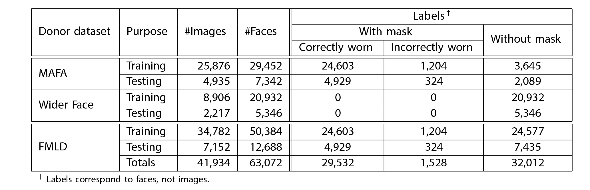
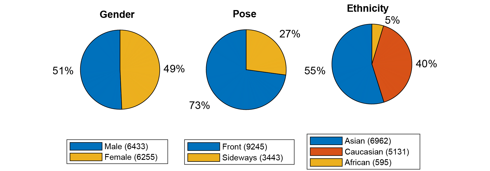
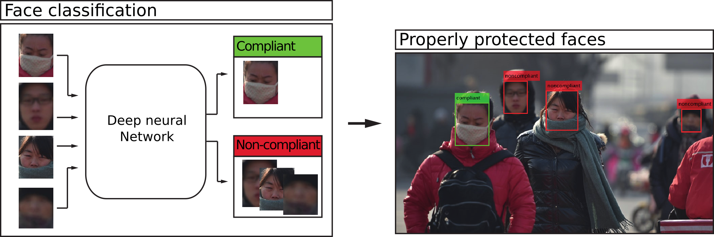

# Face Mask Label Dataset (FMLD)
A challenging, in the wild dataset for experimentation with face masks. The dataset is the biggest annotated face mask dataset with 63,072 face images.

Images annotated for FMLD were taken from datasets:
- [MAFA](https://imsg.ac.cn/research/maskedface.html) [2] [MAFA Datasets: [Google Drive](https://drive.google.com/open?id=1nbtM1n0--iZ3VVbNGhocxbnBGhMau_OG), [Kaggle](https://www.kaggle.com/rahulmangalampalli/mafa-data)] and 
- [Wider Face](http://shuoyang1213.me/WIDERFACE) [3] [Training Images: [Google Drive](https://drive.google.com/file/d/0B6eKvaijfFUDQUUwd21EckhUbWs/view?usp=sharing), Validation Images: [Google Drive](https://drive.google.com/file/d/0B6eKvaijfFUDd3dIRmpvSk8tLUk/view?usp=sharing)]

## Overall FMLD statistics

Images annotated for FMLD were taken from the MAFA and Wider Face datasets and partitioned into three classes (correctly worn masks, incorrectly worn masks and without masks) and later equipped with additional labels.



## Labels/Annotations for all images
Our annotations [1]:  [FMLD_annotations.zip](FMLD_annotations.zip)

## Dataset lists
### Lists of images from the MAFA dataset:
- [MAFA_training.txt](MAFA_training.txt)
- [MAFA_testing.txt](MAFA_testing.txt)

### Lists of images from the Wider Face dataset
- [Wider_training.txt](Wider_training.txt)
- [Wider_testing.txt](Wider_testing.txt)


As can be seen, the dataset contains labels for gender, pose and ethnicity in addition to the main labels indicating the presence of face masks and their correct/incorrect placement.

All images are annotated with labels indicating the presence of face masks, the placement of face masks (i.e., correct or incorrect), the gender of the subjects, their ethnicity and head pose.

### We used XML files in the PASCAL VOC file format for annotations. The annotation file for each image contains information about:
- the name of the original image,
- it’s size and
- the source dataset.

### The annotated face in the image can be:
- **with mask** (name: *masked_face*),
- **without mask** (name: *unmasked_face*) and
- **with mask worn incorrectly** (name: *incorrectly_masked_face*).

### Each face object has bounding box information and labels for
- gender (*male / female*),
- ethnicity (*asian / white / black*) and
- pose (*front / turned sideways*).

### Note: *difficult* label in testing dataset
- faces with invalid label in original dataset (*invalid_face*)
- faces in original dataset but not included in our FMLD dataset (*unmasked_face*)
- additional faces added using a face detector (*masked_face /unmasked_face/incorrectly_masked_face*)

## Support code

```show_save_gt.m```: MATLAB code for display images with annotations and save faces from images.

## Example usage
### Monitoring if people are using masks correctly

```resnet152.pt```: Pytorch model for classification.

```mask-test.py```: Python code to classify the correctly worn mask (*compliant/non-compliant*)



## Citation
If you use our annotations, please use following citations
```
[1] 
@Article{app10144913,
AUTHOR = {Batagelj, B.; Peer, P.; Štruc. V.; Dobrišek S.},
TITLE = {How to correctly detect face masks for COVID-19 from visual information? },
JOURNAL = {Applied Sciences},
VOLUME = {10},
YEAR = {2020},
NUMBER = {14},
ARTICLE-NUMBER = {XXXX},
URL = {https://www.mdpi.com/XXXX},
ISSN = {XXXX},
ABSTRACT = {},
DOI = {XXXX}
}

[2]
@inproceedings{ge2017detecting,
  title={Detecting Masked Faces in the Wild with LLE-CNNs},
  author={Ge, Shiming and Li, Jia and Ye, Qiting and Luo, Zhao},
  booktitle={Proceedings of the IEEE Conference on Computer Vision and Pattern Recognition},
  pages={2682--2690},
  year={2017}
}

[3]
@inproceedings{yang2016wider,
  Author = {Yang, Shuo and Luo, Ping and Loy, Chen Change and Tang, Xiaoou},
  Booktitle = {IEEE Conference on Computer Vision and Pattern Recognition (CVPR)},
  Title = {WIDER FACE: A Face Detection Benchmark},
  Year = {2016}
}

```
## License
This project is licensed under the MIT License - see the [LICENSE.md](LICENSE) file for details

